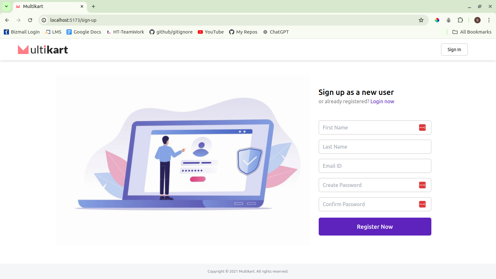

# Multikart

Multikart is a web application built using React and Vite. It includes modules for user management and a dashboard. The Users module allows displaying user details in both grid and list views and supports CRUD operations. The application also supports user authentication using Supabase Auth.

## Table of Contents

- [Installation](#installation)
- [Features](#features)
  - [Users Module](#users-module)
  - [Dashboard](#dashboard)
- [Authentication](#authentication)
- [Roles](#roles)
- [Screenshots](#screenshots)
- [License](#license)

## Installation

1. **Clone the repository:**

   ```bash
   git clone https://github.com/HT-shubhams/multikart_revised.git
   cd multikart_revised
   ```

2. **Install dependencies:**

   ```bash
   npm install
   ```

3. **Start the development server:**

   ```bash
   npm run dev
   ```

4. **Build for production:**
   ```bash
   npm run build
   ```

## Features

### Users Module

- **Display User Details:**
  - Grid View: Displays user details in a card format.
  - List View: Displays user details in a list format.
- **CRUD Operations:**
  - **Create:** Add new users.
  - **Read:** View user details.
  - **Update:** Edit user details.
  - **Delete:** Remove users from the system.
- **Sorting and Filtering:** Allows sorting and filtering of user details.

### Dashboard

- **User Counts:**
  - **Total Users:** Displays the count of all registered users.
  - **Active Users:** Displays the count of active users.
  - **Inactive Users:** Displays the count of inactive users.

## Authentication

The application uses Supabase Auth for handling user authentication, including login, signup, and reset password functionalities.

## Roles

The application supports two roles:

- **Users:** Regular users with limited access.
- **Admin:** Users with administrative privileges, including access to all CRUD operations.

## Screenshots

### SignUp




### SignIn


### User Grid View


### User List View


### Dashboard


## License

This project is licensed under the **Read License**. This project was created as a training exercise during my time at a company.
